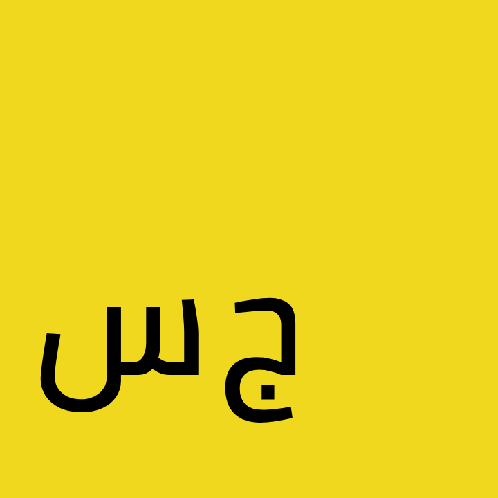

<div dir=rtl>

<div align="center">
<h1 align="center">بسم الله الرحمن الرحيم</h1>



</div>

```جس
// هذه جافاسكريبت المعربة
عرف مصفوفة_الأرقام =
	انشئ مصفوفة(10)
	.املئ(0)
	.قلل(
		(م)=> {
			م.ادفع(م[م.طول-1]+1)؛ ارجع م؛
		}، [1]
	)؛
لكل(عرف ر من مصفوفة_الأرقام) لوحة.اطبع(ر)؛
```

## طريقة الاستخدام

<div dir=ltr>

```bash
❯ npm i -D @arabi/core @arabi/maps
❯ npm i @arabi/translate
```

```js
const arabi = require('@arabi/core');
const arabiMaps = require('@arabi/maps');

const options = {
  input: '/path/to/file/or/dir',
  output: '/another/path', // the output is the same type as input
  // if input is dir, and you have an entry point
  // otherwise all files will be translated independently
  entry: '/path/to/the/entry',
  maps: arabiMaps.window
};

arabi.translate(options);
```

</div>

---

لقد تصدرت اللغة الإنجليزية في كل مجالات الحياة بعدما كانت لغة كتاب الله هي اللؤلؤة المتألقة والمبتغى لكل طالب علم، فقد انعكست القاعدة وتبدلت الأوضاع. وأظن أن ما نشر تلك اللغة هي الحروب والغزو الذي قامت به بريطانيا أو المملكة المتحدة، وما تبعها من الهيمنة الأمريكية.

فقد وجب علينا نحن المسلمين عموما (والعرب خصوصا) أن نعيد منارة العلم على بحر اللغة العربية وأهمها العلوم التقنية.

## كيف نعيد تشغيل منارة العلم

- مما يسرع هذا هو وجود دولة تدعم البحث العلمي الذي يصدر إجبارا باللغة العربية وينشر في مواقع ومجلات عربية ووضع بعض النسخ المترجمة ووضع محتوى بما يكفي فقط لجذب انتباه بقية العلماء للأبحاث فمثلا يوضع الملخص والنتائج للبحث. فلو استطعنا أن نسبق البقية في مضمار العلم والاكتشافات سيجبرون قصرا على تعلم اللغة العربية.

- وأيضا قبل كل ذلك أن يتم تعريب العلوم الموجودة، لربط أطفالنا وشبابنا (علماء المستقبل) باللغة العربية، والترسيخ في عقولهم المصلحات العربية بدلا من تلك الإنجليزية.

- وأيضا من أحدى الاقتراحات أن يتم تقديم منح لطلاب العلم من الناطقين باللغات الأجنبية ليدرسوا في بلادنا وتحفيزهم وحتى إن وصل الأمر أن يُدفع للنابغين منهم مبالغ مالية ليقدروا على تحمل نفقة العيش.

## ضوء خافت ينبثق

إنني حينما ابتدأت هذا المشروع، لم تكن المحاولة الأولى، إنما ذلك الشغل الشاغل لمحبي لغتهم والمعتزين بها، التي كانت لغة العلم وستعود بإذن الله. فقد وجدت بعضهم بدأ يوطئ للعلم حتى يسلك طريقه لمكانه الطبيعي.

- _**الرياضيات**_: التي كنت أدرسها ،في الأرض التي ولدت بها مصر، خلال فترة التعليم الأساسي، حيث كانت مميزة عن الفيزياء والكيمياء، محببة للقلب مع محبتنا للأخريين؛ فقلوبنا تهفوا للرموز العربية في المعادلات والحسابات الرياضيات.
- _**خط.سين**_: حيث قام "غسان السقاف" بعمله الرائع وتنفيذ الفكرة التي راودتني ففضفضت بها لصديق لي، ثم ببحث على جوجل ظهر لي موقعه ([خط](https://khatt.org/)). يمكنا القول أنه عرَّب بعضا من latex.
- _**لغة ألف**_: تشرفت بمعرفة أناس حرصهم على اللغة العربية دافع لهم في حياتهم، تبادلت معهم النقاشات والآراء حول اللغة الواعدة، [الصفحة الرئيسية](https://github.com/alifcommunity/).
- _**لغة خوارزم**_: [الصفحة الرئيسية](https://alkhawarizm.org/).
- و كثير من اللغات الأخرى التي كانت مهدها نفس مهد هذه المكتبة والتي لم يقدر الله لها أن تقدم أو تتقدم كثيرا، لأنها بدأت عملا فرديا وبقيت عملا فرديا. روي عن ابن عباس رضي الله عنهما عن النبي صلى الله عليه وسلم: "يد الله مع الجماعة".

## طريق وعر

> تنويه: هذه المشكلات تم رصدها في 1442

- من المشكلات ملف "اقرأني"، الذي يعرض في جيتهاب ومدير حزم نود npm، إذ يعرض بشكل أساسي مكتوبا بالاتجاه من اليسار لليمين، ومما هو مطلوب أن نقوم بتقديم طلب لهم أن يحلوا هذه المشكلة، وبطريقة غير مباشرة أن ننشر إضافة للمتصفحات (مثلا جوجل كروم) بحيث تقوم بتعديل اتجاه الكتاب إذا بدأ السطر بحرف من اللغة العربية. والحل الذي انتقيته الآن هو وضع كل سطور (markdown) داخل وسم ل.و.ت، (لغة الوسوم التشعبية HTML)، ووضع خاصيته `dir=rtl`.
- وأيضا نجد نفس المشكلة في الكود وخصوصا إن أردت الكتابة في "VSCode" وهو ما يمكن حله أيضا بعمل إضافات له لكي يدعم الكتابة من اليمين لليسار، إلى أن يقوموا هم بإتاحة الكتابة من اليمين لليسار.

- ومن العقبات أن الكون يصعب قراءته لأنه لا يحصل له تلوين "Syntax Hightlighting" كما في باقي اللغات والأكواد البرمجية ولذا يجب أن نقوم بعمل إضافة لمحررات الأكواد.

- ومشكلة أخرى تتعلق بطبيعة كتابة اللغة العربية، فما وجدته أن اللغات اللاتينية وما يكتب بحروفها تكتب بحروف مقطعة عند التعبير عن الكلمات، على عكس اللغة العربية. وما المشكلة؟ إنها تكمن في أن كافة فروع العلم وحتى المجالات غير العلمية والجوانب المختلفة من الحياة تعتمد على الكلمات المختصرة أو ما يدعى في الإنجليزية بـ "acronym". وحل هذا بسيط جدا وذلك بكتابة الحروف العربية منفصلة أيضا، أبهرتك أليس كذلك؟! لكن يمكننا أن نفعل هذا عند الكتابة بالقلم ولا يمكننا أن نقوم بهذا على الحاسوب أو الهاتف الذكي إلا بوضع مسافات أو أي حرف من غير محارف اللغة مثل النقطة ".". وأنا أقترح أن نجعل مفتاح"CAPS" هو ما يجعل الحروف مقطعة حين الكتابة والضغط عليه متزامنين، وهذا يتطلب إلغاء الوظيفة المعتادة له في اللغات اللاتينية وتوظيفه كما نريد في اللغة العربية.

## كيف نحل كل ذلك

لتحقيق الغاية لن نقف مكتوفي الأيدي تاركين الغرب مستحوذاً على تقديم الخدمات والمنتجات البرمجية أو غيرها، فإنه على المدى البعيد ستكون منتجاتنا فهي المتصدرة والتي تدعم اللغة العربية بشكل رئيسي ثم نعطي بعد ذلك الاهتمام لما بعدها من الروافد من اللغات، إن شاء الله.

# بعض الأمثلة

يمكنك الوصول للأمثلة من خلال المسار الفرعي `.\أمثلة`، حيث يمكنك النظر فيها مباشرة واستكشاف كيف تم التعريب بناءا على معرفتك بالجافاسكريبت.

**لبناء الأمثلة:**

<div dir=ltr>

```bash
> yarn examples:build # بناء كل الأمثلة
> yarn workspace @arabi/example1 build # بناء المثال الأول
> yarn workspace '@arabi/example{1..3}' build # بناء الأمثلة من 1 إلى 3
```

</div>

## لوحة لغة الوسوم التشعبية (لوت)

[أمثلة/4.لوحة-لغة-الوسوم-التشعبية](أمثلة/4.لوحة-لغة-الوسوم-التشعبية)


## الطارة في الطرفية

[أمثلة/5.الدونت-الطارة](أمثلة/5.الدونت-الطارة)


# الخطوات القادمة

- النهوض بما تم التعليق به داخل الكود، قم بالبحث عن `TODO`.
- إنتاج "خرائط المصدر" (sourcemaps).
- إكمال [محمل وإضافة ويب_باك](https://github.com/javascript-in-arabic/webpack-plugin.git).
- إضافات لمحررات الأكواد للتلوين النحوي (syntax hightling)، وإظهار التوقع الذكي (auto-prediction).
- [واجهة السطر الأمري](https://ar.wikipedia.org/wiki/%D9%88%D8%A7%D8%AC%D9%87%D8%A9_%D8%B3%D8%B7%D8%B1_%D8%A7%D9%84%D8%A3%D9%88%D8%A7%D9%85%D8%B1)، _و_ _س_ _أ_،على [هذا المستودع](https://github.com/javascript-in-arabic/cli.git).
- العمل على التعريب نفسه بخرائط الترجمة، على [هذا المستودع](https://github.com/javascript-in-arabic/maps.git).

# الترخيص

MIT

</div>
