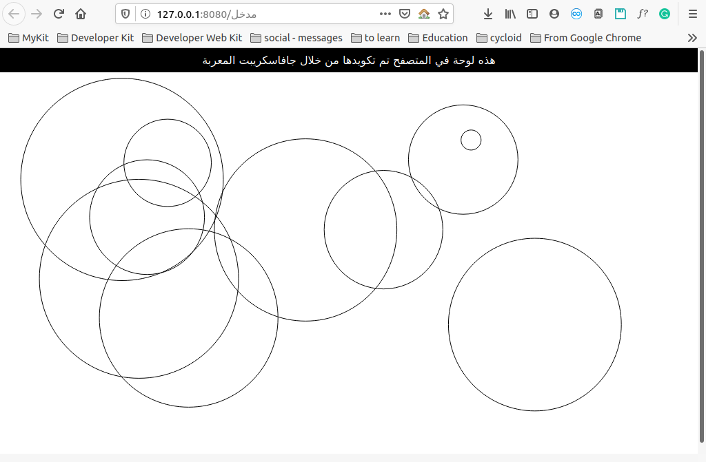

<div dir=rtl>

# لوحة لغة الوسوم التشعبية (لوت)

هذه مجموعة من وحدات الإكما (ECMAscript 6)، المتصلة معا والتي يتم ترجمتها من خلال المكتبة هذه، ثم يتم تجميعها من خلال مُحَزِّم الويب_باك. كما قمنا بالاستعانة بمحمل البابل لمعالجة الكود وتحويله.

## تشغيل

عند تنفيذ سطري الأوامر أدناه، سيفتح لك المتصفح الافتراضي على الخادم المحلي (localhost).

<div dir=ltr>

```bash
❯ npm i
❯ npm start
```

</div>

## استعراض



</div>
